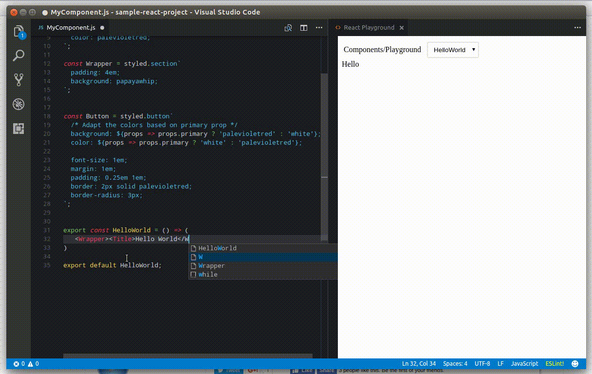

# react-playground-vscode

This plugin helps in automatically providing a webview playground of your React Component.

## Usage


Enter ctrl+shift+p and then type React Playground


## Bug/Feature Reports

Appreciate any bug/feture reports via [Github](https://github.com/wmira/react-playground-vscode/issues)

## Release Notes


### 0.0.9

* Closing and re-opening the extension should now work


### 0.0.8

* Fixes loading issue with WINDOWS. Thanks to @joriguzman for the bug report

### 0.0.6

* Upgraded to react-playground-kit 15.0.1
* Compile error now is displyed on React Playground window

### 0.0.4

Initial Preview Release. Not meant for serious usage. Feedbacks welcome.

## Preview




## Features

* Live Edit a component
* Set various props
* Automatically create test snapshots ( TODO )

## Extension Settings


## Known Issues

* Closing the Playground windowd does not seem to reopen it again.


## FAQ

* Do I need to setup webpack/babel on my workspace to have it working?

No. You can have an empty dir. Create your react component and use ctrl+shift+p to 
open the live preview.

* I need to inspect the dom. How can I do that?

You open the webview inspector. Open Keyboard Shortcuts and edit keybindings.json. Add the following:

```json
{ "key": "ctrl+shift+alt+b",  "command": "_webview.openDevTools"}     
```

Change the key as required. This should enable you to inspect the html.

* I want to have Live Playground launch a non react component. How can I do that?

React Playground will inspect any React Element but it will also evaluate an export that
starts with __Playground. So you can have the following be automatically evaluated
in React Playground

```javascript

export const __PlaygroundTestWithSomeStuff = () => {

    return (
        <SomeComponent attribute='someattr'>
            <AnotherComponent />
        </SomeComponent>
    );

}
```

You should be able to see this within the playground.